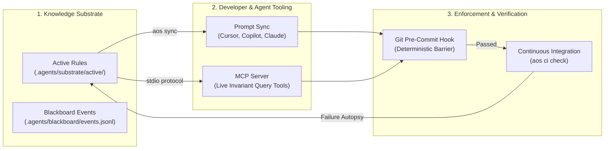

# Agent Operating Substrate (AOS)

### The Autonomous Behavior Firewall & Permanent Memory for Cursor, Copilot, and Claude Code.

[](https://www.python.org/downloads/)
[](#license)
[](#architecture)
[](docs/getting-started.md#step-5-enable-the-model-context-protocol-mcp-server)
[](docs/getting-started.md#step-6-install-the-universal-git-pre-commit-hook)

***

## Why AOS?

The Agent Operating Substrate (AOS) is a local behavior firewall and permanent memory system for AI coding assistants. It prevents tools like Cursor, GitHub Copilot, Claude Code, and Windsurf from repeating known mistakes, violating architectural boundaries, or introducing breaking diffs into your codebase.

Autonomous coding agents are transforming engineering velocity. However, as teams scale AI-assisted development into production, they run directly into three structural roadblocks:

1. **Day-One Amnesia:** Every agent session starts from a blank slate. When an agent violates an architectural invariant, introduces memory bugs, or breaks an unspoken convention, an engineer must manually intervene. Once that context window closes, the lesson evaporates. The next agent invocation repeats the identical mistake.
2. **The Human Air-Traffic Controller Bottleneck:** Multi-agent development remains strictly hub-and-spoke. Engineers spend hours manually shuttling diffs, error traces, and prompts between worker, critique, and test agents.
3. **Broken Commits and Silent Regressions:** AI agents hallucinate deprecated APIs, alter adjacent imports, and introduce diff bloat that slips past human reviewers and pollutes Git history.

**AOS turns your repository into a self-defending, self-improving substrate.** 

It provides an **Autonomous Behavior Firewall** that deterministically blocks invalid agent commits, and **Permanent Memory** that records failures as machine-enforced invariants compiled directly into every agent harness.

***

## Before AOS vs After AOS

| Dimension | Before AOS | With AOS |
| :--- | :--- | :--- |
| **Memory Retention** | **Goldfish Memory:** Lessons vanish the moment the chat context closes. The same hallucinated APIs and anti-patterns recur indefinitely. | **Permanent Repo Immunity:** Failures trigger machine-inscribed YAML invariants stored in Git. Agents inherit lessons forever. |
| **Agent Coordination** | **Human Air-Traffic Controller:** Engineers manually copy-paste diffs and prompts between worker, review, and test agents. | **Autonomous Stigmergy:** Decentralized local blackboard (`events.jsonl`). Agents coordinate unprompted through environmental traces. |
| **Code Quality Defense** | **Broken Production Commits:** Regressions and style violations slip past reviews into CI and production branches. | **Git Pre-Commit Bouncer:** Universal git hook (`aos hook run`) deterministically blocks non-compliant commits before code leaves the laptop. |
| **IDE & CLI Harmonization** | **Prompt Drift & Siloed Configs:** Fragile, manual syncing across `.cursorrules`, `.windsurfrules`, Copilot, and Claude prompts. | **Single Source of Truth:** `aos sync` compiles active substrate rules into all IDE and CLI harnesses with zero drift. |
| **Incident Response** | **Manual Post-Mortems:** Humans explain errors in chat and cross their fingers that future agents remember. | **Automated Execution Autopsy:** `aos exec` intercepts test and compiler crashes and automatically synthesizes candidate invariant rules. |
| **Rule Evolution** | **Prompt Bloat & Conflicts:** Monolithic prompt files grow unmanageable, contradict each other, and degrade model reasoning. | **Autonomous Rule Curation:** `aos curate` detects conflicts, subsumes redundant rules, and archives stale constraints automatically. |
| **Enterprise Governance** | **Fragmented Policy Spread:** Security standards live in wiki docs that AI coding agents never read. | **Cross-Repo Fleet Mesh:** `aos fleet publish` and `aos fleet sync` propagate compliance policies across hundreds of repositories. |
| **Infrastructure Overhead** | **Complex Cloud SaaS:** External vector databases, expensive SaaS orchestrators, and network latency. | **Zero External Infrastructure:** 100% local file primitives, Git-backed versioning, JSON/YAML schemas, and SQLite. |

***

## Architecture

AOS operates across three integrated planes: prompt projection, live agent context tools, and deterministic git enforcement.

```
┌─────────────────────────────────────────────────────────────────────────────┐
│                          AGENT HARNESS INTERACTION                          │
│                                                                             │
│   Cursor IDE          Windsurf IDE       GitHub Copilot      Claude Code    │
│  (.cursorrules)     (.windsurfrules)    (copilot-instr.)     (CLAUDE.md)    │
└───────────────────────────────────────▲─────────────────────────────────────┘
                                        │ (aos sync: prompt projection)
┌───────────────────────────────────────┴─────────────────────────────────────┐
│                           AGENT OPERATING SUBSTRATE                         │
│                                                                             │
│   ┌───────────────────────────┐         ┌───────────────────────────────┐   │
│   │    Active Invariants      │         │   Asynchronous Blackboard     │   │
│   │ (.agents/substrate/active)│         │ (.agents/blackboard/events)   │   │
│   └─────────────┬─────────────┘         └───────────────┬───────────────┘   │
│                 │                                       │                   │
│   ┌─────────────▼─────────────┐         ┌───────────────▼───────────────┐   │
│   │   Runtime MCP Server      │         │    Autonomous Peer Mesh       │   │
│   │ (aos_rules_check, etc.)   │         │ (worker, auditor, critic)     │   │
│   └───────────────────────────┘         └───────────────────────────────┘   │
└───────────────────────────────────────┬─────────────────────────────────────┘
                                        │
┌───────────────────────────────────────▼─────────────────────────────────────┐
│                         DETERMINISTIC GIT BARRIER                           │
│                                                                             │
│   Developer / Agent Commit ───> .git/hooks/pre-commit (aos hook run)        │
│                                  ├── Invariant Rules Evaluation             │
│                                  ├── Contiguous Diff Limits (<30 lines)     │
│                                  └── Punctuation & Style Enforcement        │
│                                  └── PASSED: Commit Recorded in Git Graph   │
│                                  └── FAILED: Deterministic Exit Code 1      │
└─────────────────────────────────────────────────────────────────────────────┘
```

### Core Architecture Components

1. **Prompt Sync:** `aos sync` compiles all active machine-readable invariants from `.agents/substrate/active/` into your team's existing agent configuration files (`.cursorrules`, `.cursor/rules/aos-invariants.mdc`, `.windsurfrules`, `.github/copilot-instructions.md`, and `CLAUDE.md`). Rules stay bounded within deterministic HTML comment tags without overwriting custom prompt instructions.
2. **Model Context Protocol (MCP) Server:** `aos mcp` provides a native stdio protocol server. Any MCP-compatible tool (Cursor, Claude Desktop, Antigravity) can dynamically query active rules, inspect file blast radius, post intents, and record failure autopsies.
3. **Git Pre-Commit Barrier:** `aos hook run` acts as the repo bouncer. Every staged diff is evaluated against active invariants before a commit is created. Violations halt execution immediately with exact file and line references.
4. **Stigmergic Blackboard:** Agents communicate asynchronously by reading and appending events in `.agents/blackboard/events.jsonl`. When a worker announces an intent, an auditor injects invariants, and an adversarial critic generates edge-case tests, entirely without human intervention.
5. **Execution Autopsy Engine:** `aos exec -- <command>` intercepts build or test failures, diagnoses root causes, and inscribes candidate rules under `.agents/substrate/candidate/` for peer review.



***

## 60-Second Quickstart

Get your repository running with autonomous agent enforcement in four simple commands:

### 1. Install AOS
AOS is built with pure Python and zero external runtime services:

```bash
pip install -e .
```

### 2. Initialize the Substrate
Create the local substrate structure under `.agents/`:

```bash
aos init
```

Output:
```text
Created config: .agents/config.yaml
Created event stream: .agents/blackboard/events.jsonl
Substrate initialized under .agents/
```

### 3. Install a Curated Rule Pack
Bootstrap production-grade guardrails for security or architecture:

```bash
aos pack install security-owasp
```

Output:
```text
Installed 3 rule(s) into active substrate:
- .agents/substrate/active/sec-sql-injection-001.yaml
- .agents/substrate/active/sec-secret-leak-002.yaml
- .agents/substrate/active/sec-ssrf-003.yaml
```

### 4. Sync Agent Prompts
Compile all active invariants into Cursor, Windsurf, Copilot, and Claude Code:

```bash
aos sync
```

Output:
```text
Synced 5 agent harness configuration(s):
- cursor: .cursorrules
- cursor_mdc: .cursor/rules/aos-invariants.mdc
- windsurf: .windsurfrules
- copilot: .github/copilot-instructions.md
- claude: CLAUDE.md
```

### 5. Install the Universal Git Pre-Commit Hook
Enforce active invariants on every commit automatically:

```bash
aos hook install
```

### 6. Verify Files Instantly
Check any file or staged diff against active invariants:

```bash
aos rules check src/
```

***

## 3 Real-World Proofs

AOS is running right now in production repositories. Here are three machine-enforced proofs executing directly inside this codebase:

### Proof 1: SIMD 32-Byte Alignment Crash Prevention
* **The Incident:** High-throughput vector geometry kernels (AVX2/AVX-512) crash with general protection faults when fed unaligned memory pointers. Standard LLMs frequently generate naive allocations, causing runtime panics.
* **The Active Invariant (`perf-simd-012.yaml`):** Requires 32-byte alignment on all buffers in `src/geometry/simd/**`.
* **The Interception:** When an agent attempts to edit vector code:
  ```bash
  aos rules check src/geometry/simd/kernel.cpp
  ```
  AOS flags the rule, binding the agent to emit `alignas(32)` buffers before code reaches the compiler.

### Proof 2: Surgical Diff & Punctuation Pre-Commit Bouncer
* **The Incident:** Coding agents frequently over-refactor code, reformatting adjacent imports, changing comments, or injecting stylistic typography like em dashes that violate conventions.
* **The Active Invariants (`aos-diff-002` and `aos-punct-001`):** Mandate surgical changes (<30 contiguous lines without justification) and zero em dashes across all prose and code.
* **The Interception:** When an agent stages a file containing forbidden punctuation:
  ```bash
  git commit -m "docs: update notes"
  ```
  The pre-commit hook runs `aos hook run` and blocks the commit deterministically:
  ```text
  [AOS Hook] Evaluating staged files against active substrate invariants...
  - [aos-punct-001] Violation: Forbidden em dash detected. (reject_diff)
  Commit blocked by AOS invariant enforcer.
  ```
  The agent reads the rejection message, corrects the punctuation, and re-commits without human intervention.

### Proof 3: Unprompted Peer Mesh Convergence
* **The Incident:** Coordinating worker, auditor, and adversarial critic agents traditionally requires manual human dispatching or expensive cloud orchestrators.
* **The Stigmergic Mesh:** Agents collaborate asynchronously through `.agents/blackboard/events.jsonl`:
  ```bash
  aos mesh simulate --desc "Optimize vector boundary conditions" --files src/geometry/simd/kernel.cpp
  ```
  Output:
  ```text
  Peer Mesh Simulation: Intent 'intent-e41c30' - Status: CONVERGED
  Emitted 5 event(s) to blackboard:
  - [INTENT_ANNOUNCEMENT] From: worker-agent
  - [INVARIANT_INJECTION] From: auditor-agent
  - [ADVERSARIAL_CHALLENGE] From: adversarial-critic-agent
  - [PEER_CRITIQUE] From: auditor-agent
  - [PEER_CONVERGENCE] From: consensus-orchestrator
  ```
  The engineering team is alerted only when consensus is reached.

***

## Enterprise Compliance & Fleet Governance

As enterprises deploy hundreds of AI coding agents across dozens of engineering teams, they face **Distributed Agent Amnesia**: team A discovers and patches a critical security flaw, but team B and team C repeat the exact same vulnerability next week.

```
Without Fleet Synchronization (Isolated & Vulnerable):
Team A fixes critical bug ──> Knowledge stays trapped in Team A repo
Team B AI writes same bug  ──> Re-enters codebase, redundant debugging
Team C AI writes same bug  ──> Reaches production incident

With AOS Enterprise Fleet Synchronization:
Team A (Origin) ──> Inscribes Rule ──> aos fleet publish
                                            │
                                            ▼
                              ┌───────────────────────────┐
                              │   Enterprise Fleet Mesh   │
                              │     (.agents/fleet.db)    │
                              └─────────────┬─────────────┘
                                            │
                                            ▼ (aos fleet sync)
               ┌────────────────────────────┴────────────────────────────┐
               ▼                                                         ▼
    Team B (Active Guardrail)                                 Team C (Active Guardrail)
    Agent blocked from mistake                                Agent blocked from mistake
```

### Key Enterprise Capabilities

* **Zero Policy Drift:** Platform and security teams publish global compliance rules (`sec-sql-injection-001`, `sec-secret-leak-002`) into the fleet mesh with `aos fleet publish`. Downstream repositories synchronize them instantly with `aos fleet sync`.
* **Auditable Provenance:** Every invariant records full compliance metadata: originating incident ID, git commit hash, author agent identity, and verification timestamps.
* **SOC2 & ISO 27001 Ready:** Invariants serve as living, version-controlled evidence that security constraints are deterministically enforced on every local commit and in CI.
* **Air-Gapped & Local-First:** Backed by local SQLite and Git. Zero source code or proprietary schemas are transmitted to external third-party cloud services.

***

## CLI Command Reference

| Command | Purpose |
| :--- | :--- |
| `aos init` | Initialize `.agents/` substrate and configuration in the target repository. |
| `aos rules list` | List all invariant rules filtered by status (`active`, `candidate`, `archive`). |
| `aos rules check <path>` | Check target files or directories against active invariant rules. |
| `aos enforce <rule-id>` | Deterministically enforce an invariant rule against target files. |
| `aos sync` | Sync active invariants into `.cursorrules`, `.windsurfrules`, Copilot, and Claude. |
| `aos hook install` | Install the universal git pre-commit hook into `.git/hooks/`. |
| `aos hook run` | Execute pre-commit validation against staged files. |
| `aos mcp` | Start the Model Context Protocol stdio server for live agent integration. |
| `aos exec -- <cmd>` | Wrap command execution with autonomous failure autopsy and rule inscription. |
| `aos pack list` | List available curated invariant rule packs. |
| `aos pack install <pack>` | Install a curated rule pack into active (or candidate) status. |
| `aos mesh simulate` | Simulate autonomous peer-to-peer agent mesh coordination. |
| `aos fleet publish <id>` | Publish a local rule to the enterprise fleet mesh. |
| `aos fleet sync` | Synchronize global fleet invariants into the local repository. |
| `aos curate` | Autonomously prune, consolidate, and archive substrate rules. |
| `aos ui` | Launch the local web dashboard visualizer. |

***

## Documentation

* [Overview & Core Thesis](docs/index.md): Motivation, failure modes, and stigmergic solution.
* [Getting Started Guide](docs/getting-started.md): Step-by-step setup, harness sync, and MCP configuration.
* [IDE & Tool Integration](docs/ide-integration.md): Setup Cursor, Claude Code, Copilot, Windsurf, and Git pre-commit hooks.
* [Control Plane Web Dashboard](docs/control-plane-ui.md): Visual tour of real-time guardrail controls, diff testing, and incident autopsies.
* [Curated Rule Packs](docs/rule-packs.md): Catalog of security, clean architecture, and SIMD performance invariant packs.
* [Architecture & Theoretical Foundations](docs/architecture.md): The three inscription loops, blackboard event bus, and mathematical model.
* [CLI Reference](docs/cli-reference.md): Complete reference of all subcommands, arguments, and environment variables.
* [Enterprise Fleet Synchronization](docs/enterprise-fleet.md): Cross-repository governance and fleet mesh management.
* [System Specification](SPEC.md): Formal YAML schemas and protocol specifications.
* [Agent Guidelines](AGENTS.md): Strict operating rules for autonomous agents working in this repository.

***

## License

Distributed under the standard MIT License.
