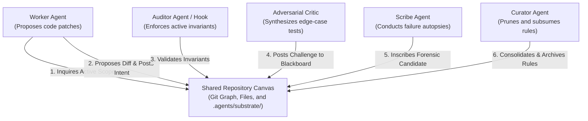
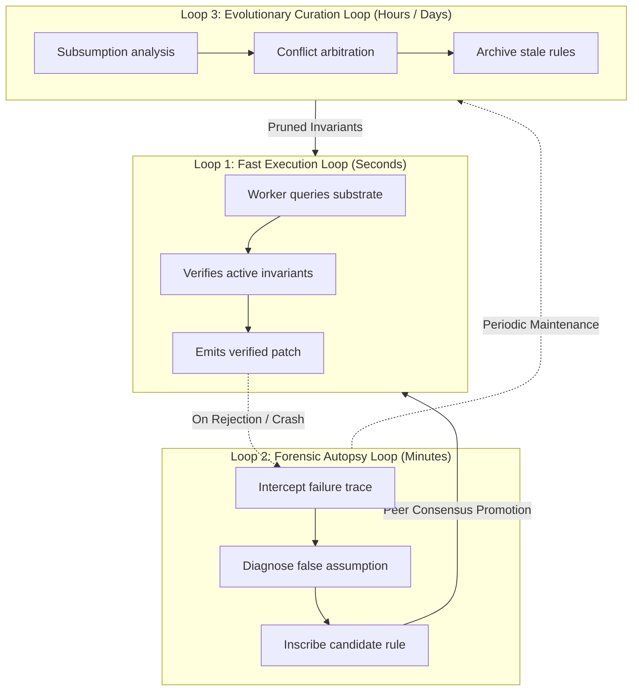
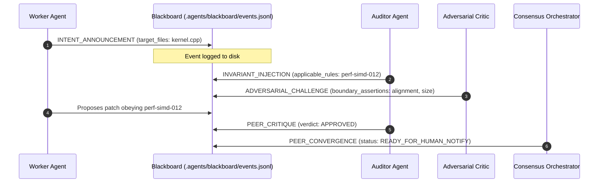

# Architecture & Theoretical Foundations

**A comprehensive exploration of decentralized stigmergy, the three autonomous inscription loops, and the local blackboard event bus.**

***

## 1. The Stigmergic Paradigm

Centralized multi-agent patterns (hub-and-spoke RPCs) collapse in software engineering:
* **Context Window Exhaustion:** Passing verbose conversation transcripts and revisions between models quickly blows context limits.
* **Synchronization Bottlenecks:** Centralized orchestrators serialize execution queues into single points of failure.
* **The Human Dispatcher Tax:** Engineers become manual routers, copying logs, pasting diffs, and triaging agent collisions.

AOS resolves this architectural failure with **stigmergy**: indirect, decentralized coordination mediated through persistent trace modifications on the repository filesystem.



### Environmental Traces in AOS

When an agent acts inside an AOS-enabled repository, it leaves three distinct types of persistent environmental traces:

1. **Code Diffs:** The physical modification to source files, tracked by the Git tree.
2. **Machine Inscriptions:** Atomic YAML rule declarations located under `.agents/substrate/`, defining machine-enforced invariants.
3. **Blackboard Events:** Structured, append-only JSON objects in `.agents/blackboard/events.jsonl`, broadcasting intents, constraints, critiques, and consensus markers.

Agents do not need to know about each other's private states. They simply read and write to the repository canvas.

***

## 2. The Three Inscription Loops

AOS operates three nested autonomous loops that continuously govern, adapt, and refine the codebase rules:



### Loop 1: The Execution Loop (Fast Cycle, Seconds)

The execution loop runs whenever a worker agent attempts to solve a task:

1. **Path & Language Matching:** The agent's target files are matched against active invariant rules via `RuleEngine.match_files()`.
2. **Deterministic Constraint Injection:** Rules scoped to the matching paths (such as memory alignment in `perf-simd-012` or punctuation rules in `aos-punct-001`) are injected into the agent's context or pre-commit checks.
3. **Blast-Radius Enforcement:** If a proposed patch exceeds the rule's `max_blast_radius_lines` limit (e.g., 30 lines in `aos-diff-002`), execution halts before changes are applied.

### Loop 2: The Forensic Autopsy Loop (Triggered on Failure)

When an operation fails (a compiler error, test regression, linter failure, or pre-commit rejection), the Forensic Autopsy loop activates:

1. **Failure Extraction:** The engine captures the exit code, standard error stream, and offending diff hunk.
2. **False Assumption Diagnosis:** The autopsy analyzer determines what underlying belief led the agent to generate faulty code.
3. **Atomic Inscription Synthesis:** The system synthesizes a candidate rule in `.agents/substrate/candidate/<rule-id>.yaml` containing an invariant statement, rationale, target paths, and enforcement mode.
4. **Peer Consensus Review:** A peer reviewer agent or human maintainer evaluates the candidate rule. Once approved, it is moved to `.agents/substrate/active/`.
5. **Proactive Prompt Inoculation:** The pre-commit barrier and autopsy engine immediately re-sync harness files (`CLAUDE.md`, `.cursorrules`, etc.) with compliant patterns and recent interception memory so agents avoid repeating the mistake.

### Loop 3: The Evolutionary Curation Loop (Background Cycle)

Rule substrates must not accumulate unbounded complexity. Left unchecked, redundant or conflicting rules cause rule bloat. The autonomous curator agent executes periodically (`aos curate`):

* **Subsumption:** If Rule B is a strict subset of Rule A (covering narrower paths with identical directives), Rule B is automatically subsumed and retired.
* **Decay & Archival:** Rules that have not been triggered across $N$ commits or 90 days are safely transitioned from `active/` to `archive/`.
* **Contradiction Arbitration:** When two rules contain mutually exclusive directives, the curator flags the conflict, generates counterfactual test cases, and establishes precedence based on verification recency and provenance.

***

## 3. The Local Blackboard Event Bus

Autonomous peer collaboration occurs over an asynchronous event bus stored at `.agents/blackboard/events.jsonl`.

### Event Structure Specification

Every event appended to the blackboard conforms to the following schema:

```json
{
  "event_id": "evt-7b891a24",
  "timestamp": "2026-09-08T18:56:10Z",
  "type": "INTENT_ANNOUNCEMENT",
  "sender": "worker-agent",
  "payload": {
    "intent_id": "intent-492",
    "description": "Optimize Voronoi boundary relaxation for AVX2",
    "target_files": ["src/geometry/simd/kernel.cpp"]
  }
}
```

### Multi-Agent Lifecycle on the Blackboard



1. **`INTENT_ANNOUNCEMENT`**: Worker announces intended changes and target files.
2. **`INVARIANT_INJECTION`**: Auditor inspects active substrate rules and attaches required constraints directly to the intent ID.
3. **`ADVERSARIAL_CHALLENGE`**: Critic injects boundary test requirements (e.g., zero-length slices, memory alignment checks).
4. **`PEER_CRITIQUE`**: Auditor evaluates proposed diff against all active rules and posts `APPROVED` or `REJECT_DIFF`.
5. **`PEER_CONVERGENCE`**: Consensus orchestrator closes the loop once all invariants pass, alerting the human only when necessary.

***

## 4. Architectural Invariants & Zero External Dependencies

AOS adheres strictly to the following architectural design principles:

### Local File Primitives Over External Infrastructure
AOS deliberately avoids external databases (PostgreSQL), message brokers (RabbitMQ, Kafka), or cloud services (Redis). All state resides in:
* Plain text YAML files under `.agents/substrate/` for human and machine readability.
* Append-only JSON Lines (`.agents/blackboard/events.jsonl`) for linear auditability.
* SQLite (`.agents/fleet.db`) for multi-repository organization-wide synchronization.

### Git as the Single Source of Truth
Every invariant rule has Git provenance: incident commit hashes, authoring agents, timestamps, and trigger counts. Invariant rules branch, merge, and travel with your codebase code reviews.

### Universal Harness Interoperability
AOS does not lock you into a single editor or model. Whether using Cursor, Claude Code, Windsurf, GitHub Copilot, or Antigravity, all agents share the exact same substrate invariants through `aos sync` and `aos mcp`.

***

## Next Steps

* [Getting Started](getting-started.md): Initialize the repository substrate and install curated packs in under 5 minutes.
* [AI Vendor Abstraction](vendor-abstraction.md): Model neutrality, prompt projection, and Git pre-commit enforcement.
* [Enterprise Fleet Governance](enterprise-fleet.md): Synchronize invariant rules across hundreds of enterprise repositories.

