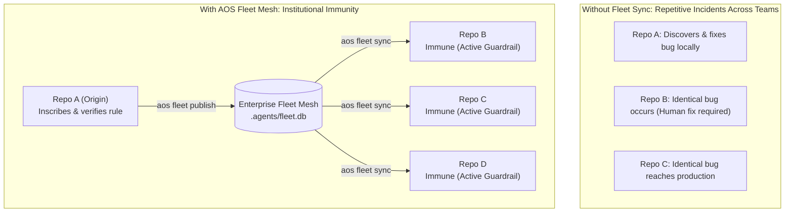
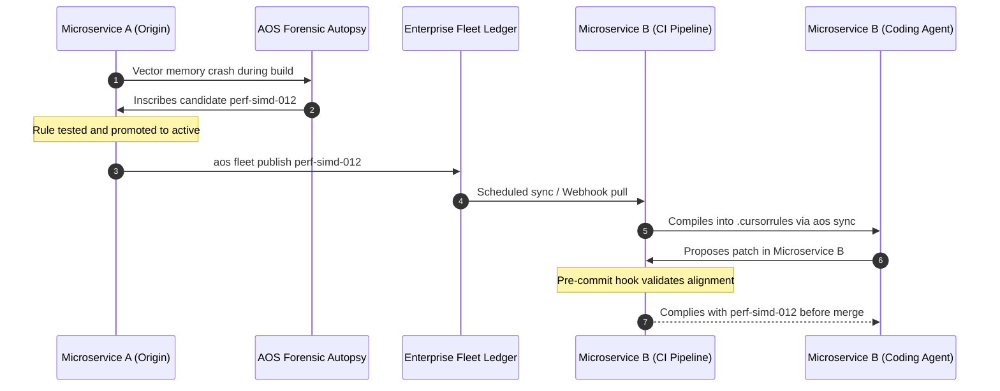

# Enterprise Fleet Synchronization

**Scale institutional memory, security compliance, and architectural invariants across hundreds of repositories autonomously.**

***

## The Enterprise Challenge: Distributed Agent Amnesia

When autonomous coding agents operate across modern software engineering organizations, they face an amplified variant of agent amnesia:

1. **Siloed Failure Lessons:** When a team debugging a high-throughput microservice discovers that unaligned vector buffers crash under AVX-512 kernels (`perf-simd-012`), that hard-won knowledge remains confined to that single repository.
2. **Repetitive Regressions Across Repositories:** Other teams building adjacent microservices make the identical architectural mistake. Agents working in those codebases generate identical buggy code, triggering redundant debugging cycles and human interventions.
3. **Compliance and Policy Drift:** Enterprise platform and security teams issue guidelines against SQL injection (`sec-sql-injection-001`) or hardcoded credentials (`sec-secret-leak-002`). Without automated machine enforcement, autonomous agents working across hundreds of Git repositories routinely violate these policies.

The diagram below contrasts the siloed model against the AOS institutional fleet mesh:



***

## The Enterprise Fleet Mesh Architecture

AOS provides an enterprise fleet synchronization protocol that connects independent repository substrates into a unified institutional knowledge mesh:

### Fleet Ledger Storage
Fleet synchronization is backed by a lightweight SQLite ledger or shared distributed file store (`.agents/fleet.db`).

The ledger records two primary tables:
* **`fleet_rules`**: Stores globally published invariant definitions, version numbers, status flags, and origin repository provenance.
* **`fleet_repos`**: Tracks participating repositories, local paths, and last synchronization timestamps.

### Database Schema Specification

```sql
CREATE TABLE fleet_rules (
    id TEXT PRIMARY KEY,
    version INTEGER,
    status TEXT,
    rule_yaml TEXT,
    origin_repo TEXT,
    published_at TEXT
);

CREATE TABLE fleet_repos (
    repo_id TEXT PRIMARY KEY,
    repo_path TEXT,
    last_synced_at TEXT
);
```

***

## Fleet Operations

The `aos fleet` command suite enables seamless publishing and synchronization across repositories:

### 1. Publishing an Invariant to the Fleet

When an invariant rule is verified and promoted in an origin repository, publish it to the organization fleet ledger:

```bash
aos fleet publish perf-simd-012 --repo-id "geom-core" --db /shared/fleet/fleet.db
```

Output:
```text
Published rule 'perf-simd-012' to fleet ledger at /shared/fleet/fleet.db
```

The complete rule specification, including rationale, scope, and enforcement directives, is now accessible to all corporate codebases.

### 2. Inspecting the Fleet Ledger

View all registered global invariants across the enterprise:

```bash
aos fleet list --db /shared/fleet/fleet.db
```

Output:
```text
Found 3 fleet rule(s):
- [ACTIVE] perf-simd-012 (Origin: geom-core, Published: 2026-09-08T18:55:00Z)
- [ACTIVE] sec-sql-injection-001 (Origin: security-secops, Published: 2026-09-08T19:00:00Z)
- [ACTIVE] aos-punct-001 (Origin: platform-standards, Published: 2026-09-08T19:15:00Z)
```

### 3. Synchronizing Local Repositories from the Fleet

Downstream repositories pull all active fleet invariants into their local `.agents/substrate/active/` directory:

```bash
aos fleet sync --db /shared/fleet/fleet.db
```

Output:
```text
Synced 3 rule(s) from fleet ledger into .agents/substrate/active/
```

After synchronization, update the local agent harness files:

```bash
aos sync
```

Every agent working in that repository (in Cursor, Windsurf, Copilot, or CLI) immediately inherits the new organizational guardrails.

### 4. Portable Fleet Bundles (GitOps Export & Import)

For GitOps pipelines, code reviews, or air-gapped repositories where sharing a network database is prohibited, AOS supports exporting and importing portable JSON bundles:

```bash
# Export active fleet rules to a versioned bundle
aos fleet export --output .agents/enterprise-bundle.json

# Import rules from a bundle into the local fleet ledger
aos fleet import .agents/enterprise-bundle.json
```

***

## Lifecycle of an Enterprise Invariant

Here is how an enterprise rule evolves from a localized bug to an organization-wide automated constraint:



1. **Incident in Origin Service:** An unaligned buffer causes a crash during high-throughput execution in Microservice A.
2. **Forensic Inscription:** The autopsy engine synthesizes rule `perf-simd-012`.
3. **Local Promotion:** Microservice A tests and promotes the rule to active status.
4. **Fleet Publication:** Microservice A publishes the invariant to the enterprise fleet ledger.
5. **Organization Synchronization:** A scheduled job or CI trigger synchronizes the rule across all 500 company repositories.
6. **Proactive Immunity:** When an agent in Microservice B prepares a diff, the newly synced invariant is already active. The agent generates aligned memory buffers from the start, preventing the failure before it ever occurs.

***

## CI/CD Pipeline Integration

Enforce fleet compliance automatically on every pull request using the included GitHub Action.

Add `.github/workflows/aos-invariants.yml` to your repositories:

```yaml
name: "AOS Invariant Compliance"

on:
  pull_request:
    branches: ["main"]

jobs:
  verify-invariants:
    runs-on: ubuntu-latest
    steps:
      - name: Checkout Code
        uses: actions/checkout@v4
        with:
          fetch-depth: 0

      - name: Run AOS Invariant Evaluation
        uses: ./action.yml
        with:
          base-ref: "origin/main"
          auto-sync: "false"
```

### Pull Request Check Report

When the action runs, it outputs a clean, Markdown-formatted evaluation directly in the job summary:

```text
## AOS Invariant Verification Report

**Status**: PASSED
**Files Evaluated**: 18
**Violations Detected**: 0

All modified files strictly comply with active substrate invariants.
```

If any commit violates an active invariant, the pull request check fails with line-level diagnostics, preventing regressions from merging into the main branch.

***

## Institutional Benefits for Platform Teams

* **Permanent Bug Elimination:** Once an incident is autopsied in one repository, the solution propagates organization-wide. Bugs cannot recur.
* **Deterministic Policy Enforcement:** Security teams enforce OWASP rules directly at the code level, eliminating manual security review backlogs.
* **Zero Infrastructure Overhead:** The fleet ledger uses local files or lightweight SQLite databases, avoiding the need for dedicated servers, daemon processes, or cloud API tokens.
* **Autonomous Operations:** Rules propagate, synchronize, and enforce themselves without human platform engineers having to manually update prompt templates.
