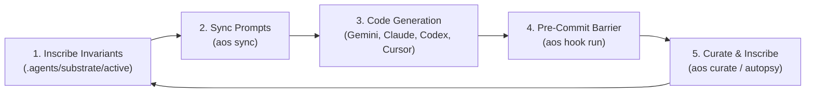

# Getting Started

### Transform any software repository into a self-defending, self-improving agent workspace in minutes.

***

## What You Achieve in 5 Minutes

AOS equips any software repository with a vendor-agnostic behavior firewall, permanent failure memory, and multi-agent coordination in under five minutes.

By completing this guide, you will deploy:
1. **The Universal Git Pre-Commit Barrier:** Deterministically blocks broken agent commits and non-compliant code before it leaves your machine.
2. **Single-Source Prompt Synchronization:** Compiles active invariants into `.cursorrules`, `.windsurfrules`, `.github/copilot-instructions.md`, and `CLAUDE.md`.
3. **Live Model Context Protocol (MCP) Server:** Equips AI agents with interactive rule-checking tools inside their native IDE context.
4. **Automated Failure Autopsies:** Turns runtime compiler errors and test crashes into permanent, machine-enforced invariant rules.
5. **Production Security Baselines:** Applies curated OWASP and clean architecture rules instantly.

**Requirements:** Python 3.11+ and Git. Zero cloud accounts, zero external microservices, and zero changes to existing source code.

***

## Jargon Translated: The Core Concepts

AOS introduces a few specialized terms rooted in decentralized systems. Here is what they mean in everyday engineering practice:

| Technical Term | What It Means in Practice |
| :--- | :--- |
| **Substrate** | The local `.agents/` directory in your repository storing machine-readable rules, candidate inscriptions, and coordination blackboards. |
| **Invariant** | A non-negotiable repository law (e.g. memory alignment, SQL injection prevention, or surgical diff limits) that code cannot violate. |
| **Harness Sync** | Automatically compiling active rules into prompt instructions for Cursor, Windsurf, GitHub Copilot, and Claude Code (`aos sync`). |
| **Model Context Protocol (MCP)** | A standard protocol (`aos mcp`) allowing agents to query active invariants and check diff blast radius interactively while generating code. |
| **Behavior Firewall (Git Hook)** | A local Git pre-commit barrier (`aos hook run`) that halts invalid commits with exact line numbers and remediation advice. |
| **Execution Autopsy** | An automated wrapper (`aos exec`) that captures command failures, isolates root causes, and generates candidate invariant rules. |
| **Stigmergy & Blackboard** | An append-only event ledger (`events.jsonl`) where multiple agents coordinate asynchronously through file traces without human routing. |

***

!!! tip "Zero External Dependencies"
    AOS is pure Python standard library and local filesystem primitives (JSON, YAML, SQLite). It requires no Docker daemon, no vector database, and no cloud subscriptions.

## Step 1: Installation

AOS is packaged as a standard Python distribution with zero external runtime infrastructure:

```bash
# Clone or navigate to your target repository
cd /path/to/your/repository

# Install AOS in editable mode
pip install -e .
```

Verify that the CLI is accessible on your system PATH:

```bash
aos --help
```

Output:
```text
usage: aos [-h] [--root ROOT]
           {init,rules,enforce,sync,hook,mcp,daemon,mesh,ci,fleet,exec,pack,ui,autopsy,curate,blackboard} ...

Agent Operating Substrate: Stigmergic runtime for autonomous coding agents.
```

***

## Step 2: Initialize the Repository Substrate

Run `aos init` at the root of your repository:

```bash
aos init
```

Output:
```text
Created config: .agents/config.yaml
Created event stream: .agents/blackboard/events.jsonl
Substrate initialized under .agents/
```

### The Substrate Directory Layout

`aos init` generates the following directory hierarchy under `.agents/`:

```
.agents/
├── substrate/
│   ├── active/            # Actively enforced invariant rules
│   ├── candidate/         # Inscriptions awaiting peer consensus
│   └── archive/           # Pruned or subsumed historical rules
├── blackboard/
│   ├── intents/           # Registered worker intents
│   ├── critiques/         # Peer auditor critique notes
│   └── events.jsonl       # Append-only asynchronous event ledger
├── config.yaml            # Substrate daemon and retention settings
└── fleet.db               # Optional SQLite enterprise fleet database
```

### Configuration (`.agents/config.yaml`)

```yaml
version: 1
substrate:
  path: ".agents/substrate"
  auto_archive_days: 90
blackboard:
  path: ".agents/blackboard"
  event_log: ".agents/blackboard/events.jsonl"
daemon:
  poll_interval_seconds: 5
```

***

## Step 3: Install Curated Invariant Rule Packs

Bootstrap production-grade security and architectural standards immediately using built-in rule packs:

```bash
# List available curated packs
aos pack list
```

Output:
```text
Available Curated Invariant Packs:
- security-owasp (3 rules)
- python-clean-architecture (4 rules)
- performance-simd (2 rules)
```

Install and immediately activate the OWASP security pack in your substrate:

```bash
aos pack install security-owasp
```

Output:
```text
Installed 3 rule(s) into active substrate:
- .agents/substrate/active/sec-sql-injection-001.yaml
- .agents/substrate/active/sec-secret-leak-002.yaml
- .agents/substrate/active/sec-ssrf-003.yaml
```

Verify the active rules in your substrate:

```bash
aos rules list
```

Output:
```text
Substrate Rules (root: .):
  [ACTIVE] sec-secret-leak-002: Hardcoded secrets, API keys, private credentials, and authorization tokens must never be committed. (v1)
  [ACTIVE] sec-sql-injection-001: Raw SQL query string concatenation is prohibited. All database queries must use parameterized queries or ORM bindings. (v1)
```

!!! tip "Automated Repository Ingestion: `aos ingest`"
    Instead of picking packs manually, you can run `aos ingest --promote --install-packs` to automatically scan your repository manifests (`tsconfig.json`, `pyproject.toml`, `Cargo.toml`, `go.mod`) and team instructions (`CLAUDE.md`, `AGENTS.md`) to synthesize tailored guardrails matching your stack.

***

## Step 4: Sync Agent Harness Configurations

Different engineers on your team use different models and tools: Google Gemini (Gemini Code Assist / Antigravity), Anthropic Claude (Claude Code), OpenAI Codex / ChatGPT, GitHub Copilot, Cursor, Windsurf, or Aider.

Rather than maintaining separate prompt instructions in each tool or suffering prompt drift across different LLM providers, `aos sync` compiles all active rules from `.agents/substrate/active/` and injects them directly into your agent harness configuration files:

=== "Sync All Connected Tools"
    ```bash
    aos sync
    ```

    Output:
    ```text
    Synced 14 agent harness configuration(s):
    - cursor: .cursorrules
    - cursor_mdc: .cursor/rules/aos-invariants.mdc
    - gemini: .gemini/instructions.md
    - gemini_root: GEMINI.md
    - codex: .openai/instructions.md
    - codex_root: CODEX.md
    - claude: CLAUDE.md
    - windsurf: .windsurfrules
    - copilot: .github/copilot-instructions.md
    - aider: CONVENTIONS.md
    - cline: .clinerules
    - roo: .roomodes
    - amazonq: .amazonq/rules.md
    - agents: AGENTS.md
    ```

=== "Target Specific Tools"
    You can also target specific harnesses when needed:

    ```bash
    # Target only Cursor and Claude Code
    aos sync --harnesses cursor,claude

    # Target Gemini and GitHub Copilot
    aos sync --harnesses gemini,copilot
    ```

***

## Step 5: Enable the Model Context Protocol (MCP) Server

AOS provides a first-class Model Context Protocol (MCP) server over standard input and output (stdio). Any MCP-capable client (Cursor, Claude Desktop, Antigravity, Gemini Code Assist, Cline, or custom agent runtimes) can query invariants and announce intents natively.

Start the server:

```bash
aos mcp
```

### Available MCP Tools

* **`aos_rules_check`**: Evaluates target file paths against active invariants and returns matching rules and detected violations.
* **`aos_rules_list`**: Lists all rules filtered by status (`active`, `candidate`, `archive`).
* **`aos_autopsy`**: Inscribes a candidate invariant rule from an execution failure.
* **`aos_blackboard_post`**: Broadcasts an event or intent announcement on the local blackboard.

### Client Configuration Example

Add the following to your MCP client configuration (such as `claude_desktop_config.json` or Cursor MCP settings):

```json
{
  "mcpServers": {
    "aos": {
      "command": "aos",
      "args": ["mcp"]
    }
  }
}
```

Now, when an LLM agent plans a change in your project, it calls `aos_rules_check` autonomously to retrieve active invariants before drafting code.

***

## Step 6: Install the Universal Git Pre-Commit Hook

AOS prevents broken invariants from ever entering your Git commit graph. Install the universal pre-commit hook:

```bash
aos hook install
```

Output:
```text
Installed AOS pre-commit hook at .git/hooks/pre-commit
```

### Pre-Commit Invariant Evaluation

When you or an agent runs `git commit`, the hook automatically triggers `aos hook run`, which scans all staged files against active invariants:

```bash
# Verify staged files manually without committing
aos hook run
```

If a staged file violates an active invariant (such as forbidden em dashes in `aos-punct-001` or diff expansion exceeding limits in `aos-diff-002`), the commit is rejected immediately with exact line numbers and remediation instructions.

To remove the hook at any time:

```bash
aos hook uninstall
```

***

## Step 7: Automated Execution Autopsy

When developing code, tests fail and compilers exit with non-zero codes. AOS provides an execution wrapper that intercepts command failures, diagnoses the error, and automatically writes a candidate invariant rule:

```bash
# Wrap test or build commands with aos exec
aos exec -- pytest tests/test_simd.py
```

If the command succeeds, `aos exec` exits cleanly with return code 0.

If the command fails:
1. `aos exec` captures stdout and stderr.
2. It synthesizes a failure summary and diagnosis.
3. It inscribes a new candidate rule directly into `.agents/substrate/candidate/autopsy-fail-<timestamp>.yaml`.

You or an autonomous curator agent can then review and promote the candidate rule to active status.

***

## Step 8: Autonomous Peer Mesh Simulation

AOS agents collaborate asynchronously without requiring a human router. Simulate a multi-agent review cycle:

```bash
aos mesh simulate --desc "Implement high-speed geometry parser" --files src/geometry/parser.py
```

Output:
```text
Peer Mesh Simulation: Intent 'intent-b29c11' - Status: CONVERGED
Emitted 5 event(s) to blackboard:
- [INTENT_ANNOUNCEMENT] From: worker-agent
- [INVARIANT_INJECTION] From: auditor-agent
- [ADVERSARIAL_CHALLENGE] From: adversarial-critic-agent
- [PEER_CRITIQUE] From: auditor-agent
- [PEER_CONVERGENCE] From: consensus-orchestrator
```

The worker announces its intent, the auditor injects active invariants, the adversarial critic synthesizes stress cases, and the peer mesh converges before human review begins.

***

## Step 9: Launch the Visualizer Web UI

Inspect active rules, candidate autopsies, blackboard events, and peer critiques in a local browser dashboard:

```bash
aos ui --port 8484
```

Open `http://127.0.0.1:8484` in your web browser to explore your repository's living substrate.

***

## Summary of the Daily Workflow



Your coding agents now operate within strict, machine-enforced guardrails that improve after every failure.

***

## Next Steps

* [AI Vendor Abstraction](vendor-abstraction.md): Deep dive on decoupling repository invariants and control planes from LLM providers.
* [IDE & Tool Integration](ide-integration.md): Step-by-step setup for Cursor, Claude Code, Copilot, Windsurf, and Git pre-commit hooks.

* [Control Plane Web Dashboard](control-plane-ui.md): Visual tour of real-time guardrail controls, diff testing, and incident autopsies.
* [Curated Rule Packs](rule-packs.md): Catalog of security, clean architecture, and SIMD performance invariant packs.
* [Architecture & Theoretical Foundations](architecture.md): Deep dive into the three inscription loops and stigmergy.
* [CLI Reference](cli-reference.md): Detailed documentation for all `aos` commands and flags.
* [Enterprise Fleet Governance](enterprise-fleet.md): Synchronize invariant rules across hundreds of repositories.
