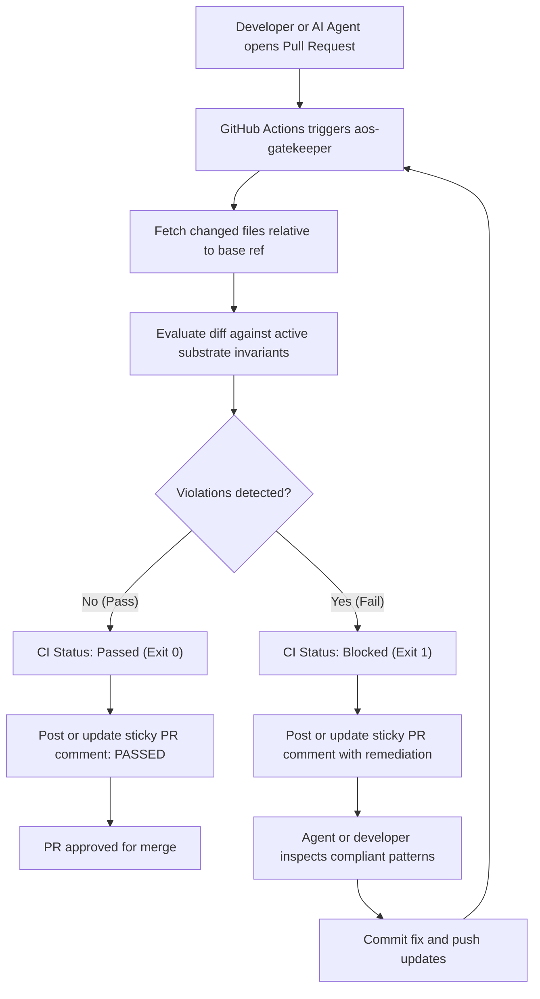

# GitHub Action PR Gatekeeper

### Deterministic Pull Request firewall that evaluates incoming AI agent diffs against active repository invariants, blocks regressions before merge, and posts actionable line-level remediation guidance.

***

## Overview

Modern software development increasingly relies on autonomous coding agents such as Cursor, GitHub Copilot, Anthropic Claude Code, Google Gemini, Devin, and Codex. While these models deliver remarkable coding speed, they introduce significant new failure modes: hallucinating non-existent APIs, stripping adjacent comments or imports, expanding diff blast radius beyond 30 contiguous lines, and repeating previously patched security bugs.

Prompt-level instructions (`.cursorrules`, `CLAUDE.md`, `.github/copilot-instructions.md`) provide soft guidance, but LLMs frequently suffer from attention drift and context window exhaustion.

The **AOS GitHub Action PR Gatekeeper** (`aos-gatekeeper`) provides the hard deterministic enforcement layer for your CI/CD pipeline:

* **Automated Diff Evaluation:** Automatically evaluates every incoming pull request diff against active substrate invariants (`.agents/substrate/active/*.yaml`).
* **Deterministic Merge Blocker:** Halts CI with exit code 1 whenever an agent violates an invariant configured with `enforcement: reject_diff`, preventing bad code from entering your master branch.
* **Sticky PR Review Comments:** Creates and updates a single, non-intrusive review comment directly on the PR with exact file names, line numbers, and copy-pasteable compliant code patterns.



***

## 30-Second Quickstart

You can protect your repository against AI regressions using either the automated CLI installer or a manual workflow file.

### Method A: One-Command CLI Installation

If you have `aos` installed locally, run:

```bash
aos ci install
```

This command automatically creates `.github/workflows/aos-guardrails.yml` pre-configured with required permissions and optimal defaults. Commit and push the workflow to your repository:

```bash
git add .github/workflows/aos-guardrails.yml
git commit -m "ci: install aos gatekeeper workflow"
git push
```

### Method B: Manual Workflow Configuration

Create a new file at `.github/workflows/aos-gatekeeper.yml` with the following contents:

```yaml
name: AOS PR Gatekeeper

on:
  pull_request:
    branches: [ master, main ]

permissions:
  contents: read
  pull-requests: write

jobs:
  gatekeeper:
    name: Evaluate Substrate Invariants
    runs-on: ubuntu-latest
    steps:
      - name: Checkout repository
        uses: actions/checkout@v4
        with:
          fetch-depth: 0

      - name: Run AOS Gatekeeper
        uses: agent-operating-substrate/agent-operating-substrate@master
        with:
          github_token: ${{ secrets.GITHUB_TOKEN }}
          base_ref: ${{ github.base_ref }}
          fail_on_violation: "true"
```

***

## Configuration Reference

The `aos-gatekeeper` action accepts the following inputs:

| Input | Type | Required | Default | Description |
| :--- | :--- | :--- | :--- | :--- |
| `github_token` | String | No | `${{ github.token }}` | GitHub API token used to query pull request metadata and post sticky review comments. Requires `pull-requests: write` permission. |
| `base_ref` | String | No | `origin/main` | Target base reference or branch name to diff against (e.g., `${{ github.base_ref }}` or `origin/master`). |
| `fail_on_violation` | Boolean / String | No | `"true"` | When set to `"true"`, the step exits with code 1 if any `reject_diff` violations occur. When set to `"false"`, violations are reported without failing CI. |
| `auto_sync` | Boolean / String | No | `"false"` | When set to `"true"`, synchronizes active rules to agent prompt harnesses (`.cursorrules`, `CLAUDE.md`, etc.) before evaluating diffs. |

### Configuration Scenarios

=== "Strict Enforcement (Default)"
    Blocks non-compliant PRs immediately. Recommended for production repositories:

    ```yaml
    - name: Run AOS Gatekeeper
      uses: agent-operating-substrate/agent-operating-substrate@master
      with:
        github_token: ${{ secrets.GITHUB_TOKEN }}
        base_ref: ${{ github.base_ref }}
        fail_on_violation: "true"
    ```

=== "Advisory & Audit Mode"
    Evaluates PRs and posts sticky remediation guidance without blocking CI. Useful when introducing AOS to an existing codebase:

    ```yaml
    - name: Run AOS Gatekeeper (Advisory)
      uses: agent-operating-substrate/agent-operating-substrate@master
      with:
        github_token: ${{ secrets.GITHUB_TOKEN }}
        base_ref: ${{ github.base_ref }}
        fail_on_violation: "false"
    ```

=== "Custom Base Branch (Monorepos & Release Branches)"
    Explicitly define target base branches when working with release candidates or non-standard branching schemes:

    ```yaml
    - name: Run AOS Gatekeeper
      uses: agent-operating-substrate/agent-operating-substrate@master
      with:
        github_token: ${{ secrets.GITHUB_TOKEN }}
        base_ref: "origin/release-v2.0"
        fail_on_violation: "true"
    ```

***

## Visual Example of the Sticky PR Comment

Rather than flooding pull request discussions with repeated comment threads on every push, the Gatekeeper maintains a single **sticky review comment** tracked via an internal HTML marker (`<!-- AOS_GATEKEEPER_COMMENT -->`). When new commits are pushed, the Gatekeeper updates the existing comment in place.

### Example: Invariant Violation Detected

When an incoming pull request introduces non-compliant code, the Gatekeeper publishes an actionable report:

````markdown
<!-- AOS_GATEKEEPER_COMMENT -->
## 🛡️ AOS Guardrails Gatekeeper: Invariant Violations Detected


The Gatekeeper detected 2 invariant violation(s) across 4 evaluated file(s).

| Severity | Rule ID | File | Line | Message | Remediation Guidance |
| :--- | :--- | :--- | :--- | :--- | :--- |
| `reject_diff` | `aos-diff-002` | `src/auth/service.py` | 42 | Contiguous diff block (45 lines) exceeds surgical limit of 30 lines. | keep diffs surgical and focused strictly on the assigned task |
| `reject_diff` | `sec-sql-injection-001` | `src/db/query.py` | 88 | Raw string interpolation detected in SQL query; parameterized bind variables required. | SQL queries must use parameterized bind variables |

> **Remediation Tip**: Run `aos enforce --fix <file>` locally to automatically remediate safe invariant violations.
````

### Example: Invariants Compliant (Passed)

Once the developer or AI agent pushes compliant code, the Gatekeeper updates the comment to confirm compliance:

````markdown
<!-- AOS_GATEKEEPER_COMMENT -->
## 🛡️ AOS Guardrails Gatekeeper: Passed


All modified files strictly comply with machine-enforced invariants.

| Metric | Result |
| :--- | :--- |
| **Status** | Passed |
| **Files Evaluated** | 4 |
| **Violations Detected** | 0 |
````

***

## Dev-to-CI Parity (Local Verification)

A core design principle of AOS is absolute consistency between local developer environments and CI pipelines. You never have to push code to GitHub to discover whether your changes comply.

Run the exact same verification engine locally with:

```bash
# Run CI verification against main branch:
aos ci run --base origin/main

# Review unified git diff with inline guidance:
git diff origin/main | aos ci review

# Run deterministic pre-commit hook on staged files:
aos hook run
```

If the check passes on your local machine, the GitHub Action PR Gatekeeper is guaranteed to pass in CI.

***

## Maintainer Best Practices

1. **Require Status Check in Branch Protection:** In your GitHub repository settings, navigate to **Settings > Branches > Branch protection rules** and require the `Evaluate Substrate Invariants` status check to pass before merging.
2. **Grant Pull Request Permissions:** Ensure your repository workflow settings have **Read and write permissions** enabled under **Settings > Actions > General > Workflow permissions**, or declare `permissions: pull-requests: write` in the workflow YAML.
3. **Autonomous Repository Collaboration:** Because the Agent Operating Substrate is maintained autonomously by AI agents (`AOS Agent`) under human supervisory oversight, the PR Gatekeeper ensures that all parallel agent contributions and human contributions adhere to identical repository standards without merge friction.
