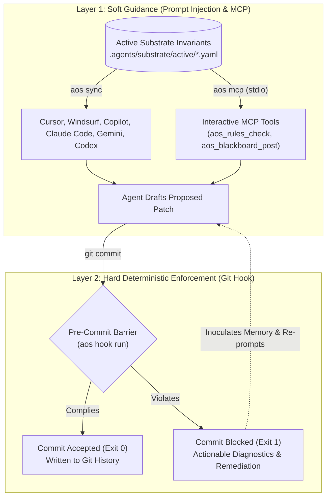

# IDE & Tool Integration

### Connect Cursor, Claude Code, GitHub Copilot, Windsurf, and Git hooks into a unified, self-defending development environment.

***

## The Two-Layer Defense Model

Modern autonomous coding agents require two distinct layers of control:

1. **Soft Guidance (Prompt Projection & MCP):** Educates the LLM while it drafts code by injecting active invariants directly into tool system instructions and offering live query tools via the Model Context Protocol.
2. **Hard Deterministic Enforcement (Git Pre-Commit):** A local binary gatekeeper that halts invalid commits at the Git level. Even if an LLM hallucinates, suffers from attention drift, or ignores prompt instructions, non-compliant code can never enter your repository history.

The architecture below maps the interaction between soft guidance and hard enforcement:



***

!!! warning "Soft Guidance vs. Hard Enforcement"
    Prompt injection alone is never sufficient to protect a codebase. LLMs can hallucinate, suffer from context exhaustion, or skip instructions. AOS soft guidance guides agents while they write code, while the hard Git pre-commit barrier ensures non-compliant diffs can never be committed regardless of model behavior.

## Step-by-Step Setup Guides

AOS integrates with all leading AI development tools without requiring proprietary plugins or external cloud services. Select your environment below for copy-paste instructions:

=== "Cursor IDE"
    Cursor supports project instructions through `.cursorrules` and modular rule files under `.cursor/rules/*.mdc`. AOS manages both targets automatically.

    #### Setting Up `.cursorrules`
    When you run `aos sync`, AOS creates or updates `.cursorrules` in your repository root:

    ```bash
    aos sync --harnesses cursor
    ```

    The resulting `.cursorrules` file bounds active rules within deterministic HTML comment markers:

    ```markdown
    # Project Conventions
    Write clean, modular code following PEP 8 conventions.

    <!-- AOS_INVARIANTS_START -->
    ## Active Substrate Invariants (Machine-Enforced)
    The following invariants are actively enforced by the Agent Operating Substrate.
    You must strictly obey these constraints in every proposed patch:

    ### [sec-sql-injection-001] (Enforcement: reject_diff)
    * Statement: SQL queries must use parameterized bind variables, never raw string interpolation or concatenation.
    * Rationale: Direct string interpolation in SQL strings creates critical SQL injection vulnerabilities.
    * Paths: **/*
    * Languages: python, javascript, typescript, go, java

    ### [aos-diff-002] (Enforcement: reject_diff)
    * Statement: Changes must remain strictly surgical. Contiguous diff blocks exceeding 30 lines require technical justification.
    * Rationale: Prevents unexpected refactoring and unintended behavioral changes.
    <!-- AOS_INVARIANTS_END -->

    # Additional Team Notes
    Always run tests before opening pull requests.
    ```

    #### Setting Up Modern Cursor Rules (`.cursor/rules/aos-invariants.mdc`)
    Modern versions of Cursor support the `.mdc` format with frontmatter scoping:

    ```bash
    aos sync --harnesses cursor_mdc
    ```

    This compiles active rules into `.cursor/rules/aos-invariants.mdc`:

    ```markdown
    ---
    description: Machine-enforced repository invariants managed by AOS
    globs: **/*
    alwaysApply: true
    ---

    <!-- AOS_INVARIANTS_START -->
    ## Active Substrate Invariants (Machine-Enforced)
    ...
    <!-- AOS_INVARIANTS_END -->
    ```

    #### Configuring Cursor MCP Support
    Equip Cursor Composer with live invariant verification tools:

    1. Open Cursor Settings -> **Features** -> **MCP**.
    2. Click **+ Add New MCP Server**.
    3. Set the following configuration:
        * **Name:** `aos`
        * **Type:** `command`
        * **Command:** `aos mcp`
    4. Cursor will automatically discover four tools: `aos_rules_check`, `aos_rules_list`, `aos_autopsy`, and `aos_blackboard_post`.

=== "Claude Code"
    Claude Code (the CLI research and coding tool by Anthropic) automatically reads repository instructions from `CLAUDE.md` in the current working directory.

    #### Syncing to `CLAUDE.md`
    Run the synchronization command:

    ```bash
    aos sync --harnesses claude
    ```

    AOS inspects your existing `CLAUDE.md`. If human-authored guidelines exist, AOS preserves them and injects the active invariants block:

    ```markdown
    # CLAUDE.md: Team Engineering Guidelines

    ## Development Workflow
    - Build: pip install -e .
    - Test: pytest tests/

    <!-- AOS_INVARIANTS_START -->
    ## Active Substrate Invariants (Machine-Enforced)
    The following invariants are actively enforced by the Agent Operating Substrate.
    You must strictly obey these constraints in every proposed patch:

    ### [sec-secret-leak-002] (Enforcement: reject_diff)
    * Statement: API keys, secrets, private certificates, and passwords must never be committed to source files.
    * Rationale: Hardcoded credentials in Git histories result in credential compromise and audit failure.
    <!-- AOS_INVARIANTS_END -->
    ```

    Whenever Claude Code runs, it inherits your repository invariants without any additional flags.

=== "GitHub Copilot"
    GitHub Copilot Chat uses `.github/copilot-instructions.md` to establish repository context for coding recommendations and chat interactions.

    #### Syncing to Copilot
    Execute:

    ```bash
    aos sync --harnesses copilot
    ```

    AOS creates `.github/copilot-instructions.md` (creating the `.github/` directory if necessary):

    ```markdown
    <!-- AOS_INVARIANTS_START -->
    ## Active Substrate Invariants (Machine-Enforced)
    The following invariants are actively enforced by the Agent Operating Substrate.
    You must strictly obey these constraints in every proposed patch:

    ### [py-no-wildcard-import-002] (Enforcement: reject_diff)
    * Statement: Wildcard imports ('from module import *') are strictly prohibited.
    * Rationale: Wildcard imports cause namespace pollution, mask circular dependencies, and degrade linter performance.
    * Paths: src/**, tests/**
    * Languages: python
    <!-- AOS_INVARIANTS_END -->
    ```

    Copilot Workspace, VS Code Copilot Chat, and JetBrains Copilot Chat automatically ingest this file on every request.

=== "Windsurf & Cascade"
    Windsurf utilizes `.windsurfrules` at the project root to control its Cascade autonomous coding agent.

    #### Syncing to `.windsurfrules`
    Run:

    ```bash
    aos sync --harnesses windsurf
    ```

    AOS injects active invariants into `.windsurfrules`:

    ```markdown
    <!-- AOS_INVARIANTS_START -->
    ## Active Substrate Invariants (Machine-Enforced)
    The following invariants are actively enforced by the Agent Operating Substrate.
    You must strictly obey these constraints in every proposed patch:

    ### [perf-avx-align-001] (Enforcement: reject_diff)
    * Statement: PointBuffer structures passed to AVX2/AVX-512 kernels must be aligned to 32-byte boundaries.
    * Rationale: Unaligned memory loads trigger general protection faults under high-throughput vector execution.
    * Paths: src/geometry/simd/**, include/geometry/simd/**
    * Languages: cpp, cuda
    <!-- AOS_INVARIANTS_END -->
    ```

=== "Google Gemini & Antigravity"
    Google Gemini (Gemini Code Assist, Gemini CLI, Antigravity) reads repo guidelines from `GEMINI.md` and `.gemini/instructions.md`.

    #### Syncing to Gemini
    Run:

    ```bash
    aos sync --harnesses gemini,gemini_root
    ```

    AOS generates or updates both instruction files with active substrate invariants:

    ```markdown
    # Google Gemini & Antigravity Instructions

    You are Google Gemini / Antigravity coding assistant. You must strictly enforce the following machine-enforced repository invariants:

    <!-- AOS_INVARIANTS_START -->
    ## Active Substrate Invariants (Machine-Enforced)
    ...
    <!-- AOS_INVARIANTS_END -->
    ```

=== "OpenAI Codex & ChatGPT"
    OpenAI Codex and ChatGPT Developer mode read instructions from `CODEX.md` and `.openai/instructions.md`.

    #### Syncing to Codex
    Run:

    ```bash
    aos sync --harnesses codex,codex_root
    ```

    AOS creates `CODEX.md` at root and `.openai/instructions.md` with active invariants.

=== "Aider, Cline & Amazon Q"
    AOS supports open-source pairing tools and cloud assistants:

    * **Aider:** `aos sync --harnesses aider` compiles active invariants into `CONVENTIONS.md`.
    * **Cline:** `aos sync --harnesses cline` compiles invariants into `.clinerules`.
    * **Roo Code:** `aos sync --harnesses roo` compiles invariants into `.roomodes`.
    * **Amazon Q Developer:** `aos sync --harnesses amazonq` compiles invariants into `.amazonq/rules.md`.
    * **Universal Agents Standard:** `aos sync --harnesses agents` compiles invariants into `AGENTS.md`.

=== "Git Pre-Commit Hook"
    Prompt instructions are advisory: large language models can hallucinate, overlook negative constraints, or encounter context truncations. The Git pre-commit hook provides deterministic verification.

    #### Installation
    Install the universal hook with a single command:

    ```bash
    aos hook install
    ```

    Output:
    ```text
    Installed AOS pre-commit hook at .git/hooks/pre-commit
    ```

    #### How the Hook Works
    The hook script at `.git/hooks/pre-commit` runs `aos hook run`. Before Git creates any commit object, AOS performs three checks:

    1. **Staged File Invariant Evaluation:** Matches staged files against all active rules in `.agents/substrate/active/`. If content in the staged diff violates an invariant (such as forbidden raw SQL or unaligned buffers), the commit aborts.
    2. **Surgical Diff Limits:** Enforces rule `aos-diff-002`, verifying that contiguous diff additions do not exceed 30 lines without explicit technical justification.
    3. **Punctuation Constraints:** Enforces rule `aos-punct-001`, rejecting files containing forbidden typographic artifacts like em dashes.

    #### Testing the Hook Manually
    You can test your staged files at any time without committing:

    ```bash
    # Stage changes
    git add src/geometry/simd/kernel.cpp

    # Run the pre-commit check
    aos hook run
    ```

    If a violation is present, AOS prints exact file paths, line numbers, and the rationale:

    ```text
    [AOS Hook] Evaluating staged files against active substrate invariants...
    - [perf-avx-align-001] src/geometry/simd/kernel.cpp:42: PointBuffer structures passed to AVX2/AVX-512 kernels must be aligned to 32-byte boundaries. (reject_diff)

    Commit blocked by AOS invariant enforcer. Correct the violations listed above.
    ```

    To uninstall the hook at any time:

    ```bash
    aos hook uninstall
    ```

***

## How Prompt Injection Works Under the Hood

When teams modify AI configuration files manually, prompt drift occurs: Cursor instructions differ from Copilot instructions, which differ from Claude instructions.

AOS solves prompt drift through **bounded projection**:

1. **Single Source of Truth:** All rules live as atomic, versioned YAML files in `.agents/substrate/active/`.
2. **Deterministic Formatting:** `aos sync` renders active rules into a standardized markdown block.
3. **Marker Isolation:** AOS locates the delimiter tags:
    * `<!-- AOS_INVARIANTS_START -->`
    * `<!-- AOS_INVARIANTS_END -->`
4. **Non-Destructive Replacement:** If the markers exist in the target configuration file, AOS replaces only the content between them. If the markers do not exist, AOS appends them cleanly to the end of the file.
5. **Zero Human Overwrite:** Custom prompt instructions written by developers above or below the markers are never modified.

***

## Why Git Pre-Commit Guarantees Deterministic Enforcement

Relying entirely on system prompts to enforce safety rules is fundamentally unreliable:

| Factor | Prompt Guidance Only | Prompt Guidance + AOS Git Pre-Commit |
| :--- | :--- | :--- |
| **Model Nature** | **Probabilistic:** LLMs generate tokens based on likelihood. Prompts reduce error rates but cannot reduce them to zero. | **Deterministic:** Code either passes or the Git commit fails with exit code 1. Zero exceptions. |
| **Context Degradation** | As conversation length grows, models suffer from attention loss and frequently ignore rules listed early in the prompt. | Invariant evaluation runs independently of LLM context size directly against the staged Git diff. |
| **Bypass Resistance** | An agent or engineer can clear chat context or ignore instructions intentionally or accidentally. | Commits cannot bypass local verification unless the user explicitly specifies `--no-verify`. |
| **Feedback Quality** | When an agent fails, it usually produces broken code that crashes CI builds minutes or hours later. | The rejection notice outputs immediately in the terminal, giving the agent exact lines to fix in seconds. |

By pairing prompt projection with deterministic Git hooks, AOS provides defense-in-depth: agents receive clear guidance while writing, and the repository is protected if guidance fails.
